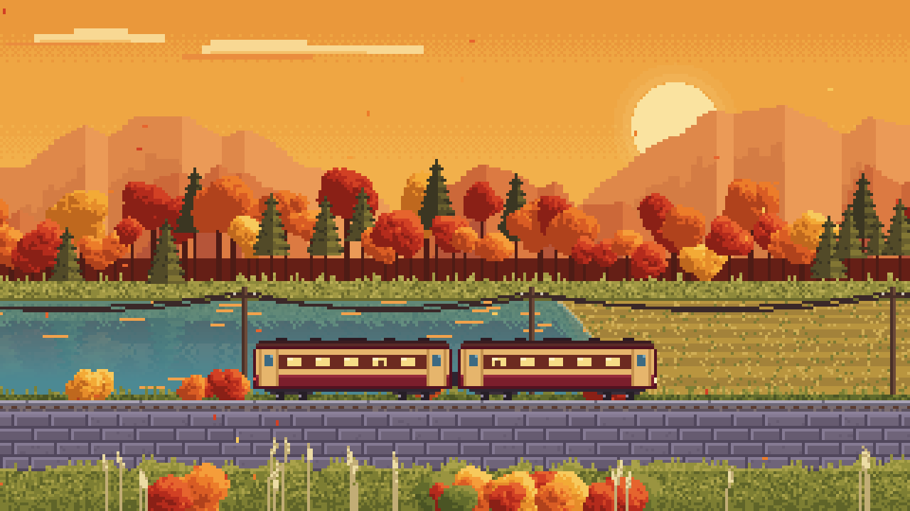
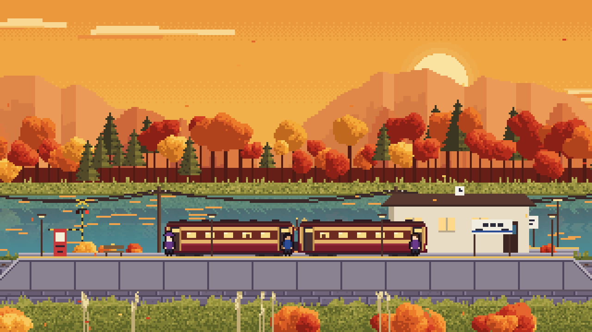
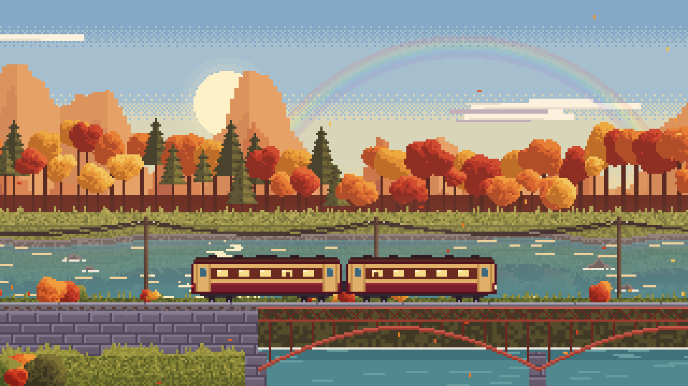
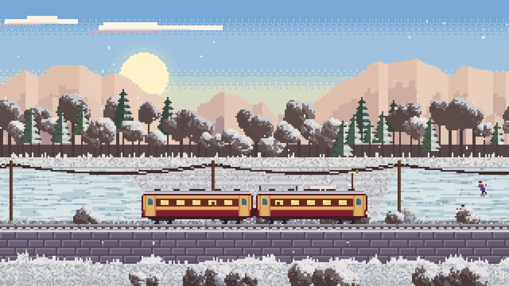
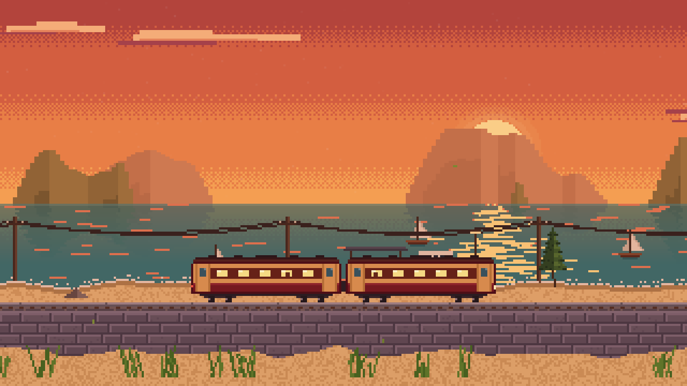
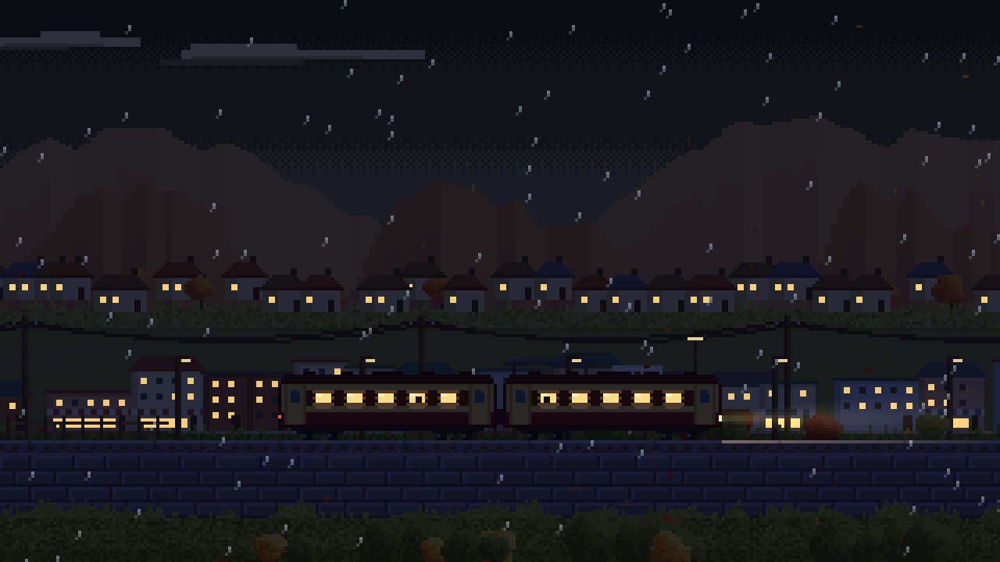
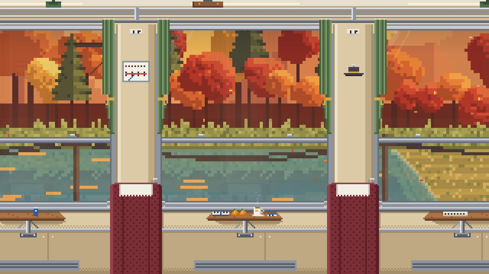

# 秋湖列车 · Pixel Train Wallpaper

一张会动的像素画：一列红白两节的小火车，沿着湖畔、花田、海边、小镇和河谷一直开下去，穿过隧道换景，经过车站停靠，四季、昼夜和天气都在变化。

**整个项目只有一个 `index.html`**。不依赖任何库，没有构建步骤，也没有图片素材。画面里的每一个像素都是代码实时算出来的，声音也是用 Web Audio 现场合成的。



| | |
|---|---|
|  |  |
|  |  |
|  |  |

## 运行

直接用浏览器打开 `index.html` 就能看到。

如果浏览器限制本地文件（极少数情况），可以在项目目录里起一个静态服务器：

```bash
python3 -m http.server 8000
```

然后访问 <http://localhost:8000>。

### 当作桌面壁纸

- **macOS**：用 [Plash](https://sindresorhus.com/plash) 把这个网页设为桌面。
- **Windows**：用 [Lively Wallpaper](https://www.rocksdanister.com/lively/) 添加这个网页。

再在控制栏里打开"壁纸模式"，界面和鼠标都会藏起来，双击画面或按 <kbd>H</kbd> 可以退出。默认开启"省电"，帧率限制在 30 帧。

## 有什么

- **五种景色**：湖畔、花田、海边、小镇、河谷。列车每隔两三分钟钻进一次隧道，出来就换一种景色。
- **四季**：
  - 春天：油菜花和樱花；
  - 夏天：薰衣草和萤火虫；
  - 秋天：红叶和稻田；
  - 冬天：雪景。雪下得越久积得越厚，湖面会结冰，还有人滑冰。
- **昼夜**：黄昏、晚霞、夜晚、黎明、清晨循环；也可以选"实时"，跟随电脑的时钟和日历，月相也是真实的。
- **天气**：
  - 晴、雨（冬天变成雪）、雾、雷雨；
  - 雨停后白天可能出现彩虹；
  - 晴朗的夜里偶尔有流星。
- **车站**：列车会刹车进站、开门，乘客上下车，然后关门开走。
- **对向列车**：一列特快偶尔从后面的轨道呼啸而过。
- **车内视角**：坐在车厢里看窗外，有窗帘、座椅、小桌上的茶和橘子。
  - 夜里玻璃上能看到对面车厢的倒影；
  - 冬天窗边结霜，下雨时玻璃上有水珠滑落。
- **声音**：默认关闭，打开后全部是程序合成的：
  - 车轮压过铁轨接缝的咔嗒声，过铁桥时声音更空；
  - 隧道轰鸣、雨声、雷声、海浪；
  - 蝉鸣、虫鸣；
  - 道口铃、车站开关门提示音。

## 快捷键

| 键 | 作用 | 键 | 作用 |
|---|---|---|---|
| <kbd>Space</kbd> | 暂停 / 继续 | <kbd>F</kbd> | 全屏 |
| <kbd>←</kbd> <kbd>→</kbd> | 车速 | <kbd>0</kbd>–<kbd>6</kbd> | 时刻（0 循环，6 实时） |
| <kbd>B</kbd> | 景色 | <kbd>S</kbd> | 季节 |
| <kbd>W</kbd> | 天气 | <kbd>V</kbd> | 车内视角 |
| <kbd>T</kbd> | 停站 | <kbd>M</kbd> | 声音 |
| <kbd>E</kbd> | 省电 | <kbd>H</kbd> | 壁纸模式 |

移动鼠标会显示底部控制栏，设置会记在浏览器里。

## 它是怎么画出来的

如果你想学习程序化像素画，下面是代码的主要思路，按在 `index.html` 里出现的顺序排列。

### 1. 低分辨率画布 + 整数倍放大

画面在一块只有约 320×180 的小画布上绘制，逐像素写进一个 `Uint32Array`（即 `ImageData` 的底层缓冲区）。然后用 CSS 的 `image-rendering: pixelated` 按整数倍放大到全屏，所以像素边缘始终是硬的。

### 2. 索引调色板

所有颜色都注册在一张调色板里（`def(name, hex, fog, em)`），场景里存的是颜色编号，而不是 RGB 值。每一帧按下面的顺序重新算一遍调色板：

1. **季节**：在春、夏、秋、冬四组颜色之间插值。冬天还会根据积雪量，在"光秃秃"和"白雪覆盖"之间过渡。
2. **时刻**：乘上当前时间的色调（`tint`）。
3. **远近雾气**：按每种颜色的 `fog` 值混入雾色，越远的东西雾越浓。
4. **自发光**：窗户、灯这类颜色（`em`）在夜里保持亮度。

所以换季节、换时间都不用重画场景，只要改调色板。

### 3. 无限滚动的视差图层

景物分成十来层，从远到近依次是云、远山、近山、树林、中景、水面、电线杆、近岸、铁轨、前景。每层有自己的视差系数 `par`，越近移动越快。

每层按 128 像素宽切成"块"（chunk）：
- 块用**固定种子**的随机数和哈希噪声生成，同一个位置无论什么时候画都一样；
- 生成结果按"块编号 + 景色类型"缓存，画面走远的块会被清掉；
- 所以画面可以无限延伸，内存却不会越吃越多。

### 4. 景色轮换藏在隧道里

世界被切成固定长度的段落，每段开头是一条隧道。隧道完全遮住屏幕的那一瞬间才切换景色，所以看不到"接缝"。为了让连续两段景色不重复，用了一个带偏移的块状排列（`biomeOfSeg`）。

### 5. 水面反射

湖面和海面的做法是：读取水线上方已经画好的像素，垂直翻转后，带一点横向波动混进水的颜色里。靠近太阳或月亮的那一列会叠加闪动的波光。

### 6. 动态元素

以下这些是每帧实时绘制的，不走缓存：
- 列车、车站和乘客；
- 对向列车；
- 落叶、雨雪和萤火虫；
- 闪电；
- 彩虹和流星；
- 车内视角。

车内视角的做法：把车外画面以 2 倍最近邻放大，再盖上一张预先生成的车厢遮罩（窗框、窗帘、座椅、桌子）。玻璃区域额外叠加淡青色、斜向反光、对面车厢的倒影和边缘的霜。

### 7. 声音

声音全部由噪声缓冲区和振荡器合成：
- 铁轨咔嗒声：短促的带通噪声加一个低频正弦；
- 雷声：长衰减的低通噪声；
- 虫鸣：一个正弦波被两个低频振荡器调制出来的；
- 车轮的节奏：每个转向架压过 40 像素一个的铁轨接缝时触发一次，所以车速越快，节奏越密。

## 项目规模

| 内容 | 数量 |
|---|---|
| 文件 | 1 个 `index.html`（约 138 KB，2,800 行） |
| JavaScript | 约 2,580 行，136 个函数 |
| CSS | 约 120 行 |
| 调色板颜色 | 280+ |
| 外部依赖 | 无（界面里的英文数字字体 Pixelify Sans 来自 Google Fonts，加载失败会自动回退到系统字体） |

## 许可证

[MIT](LICENSE)。欢迎学习、修改、拿去做你自己的壁纸。
